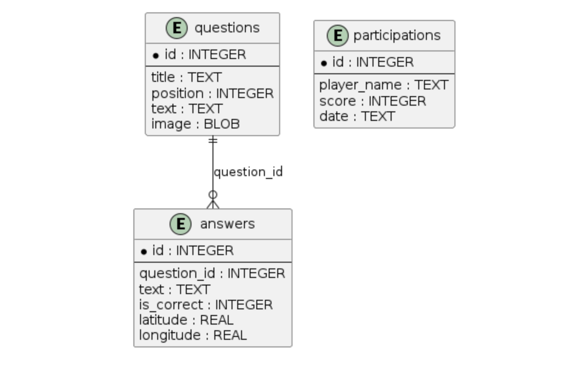
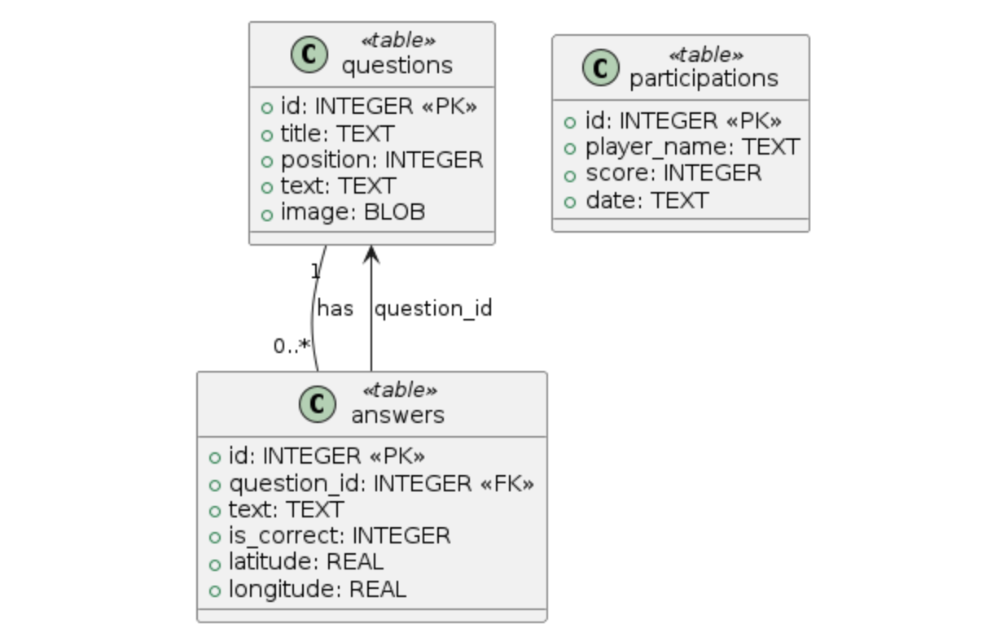

# 🧠 Quiz Application

This is a full-stack quiz application built with **Vue 3 (Vite)** on the frontend and **Flask** on the backend. It allows users to take a quiz, submit answers, and get scores. Admins can manage questions and reset the system.

# 🎦 Demo

[Demo](https://youtu.be/h35OliZo67k) / Alternative [Demo](quiz-blob/main/demo%20minimized.mp4)

---

## 📦 Project Structure

```
quiz-project/
├── quiz-ui/         # Frontend (Vue 3 + Vite)
├── quiz-api/        # Backend (Flask)
├── README.md        # You are here
```

---

## 🚀 Features

- Multiple-choice quiz interface
- Score calculation and participation tracking
- Admin login for question management
- Secure API endpoints with token authentication
- Image support for questions
- Full CORS-enabled frontend-backend interaction

---

## 🖼️ Database Architecture

The app uses a simple relational schema:




- Each **question** can have multiple **answers**
- Each **answer** can be marked as correct
- Each **participation** stores quiz submissions and scores

---

## 🧩 Tech Stack

| Layer     | Technology        |
|-----------|-------------------|
| Frontend  | Vue 3, Vite       |
| Backend   | Flask, Python     |
| Database  | SQLite            |
| Auth      | JWT (admin only)  |
| Styling   | Tailwind          |

---

## 🧑‍💻 How to Run the App

### 🟩 Frontend (`quiz-ui/`)

```bash
cd quiz-ui
npm install
npm run dev
```

Then open: [http://localhost:3000](http://localhost:3000)

---

### 🟦 Backend (`quiz-api/`)

```bash
cd quiz-api
python -m venv venv
source venv/bin/activate  # On Windows: venv\Scripts\activate
pip install -r requirements.txt
flask run
```

API will be available at: [http://127.0.0.1:5000](http://127.0.0.1:5000)

---

## 🔐 Admin Access

To manage quiz content:

1. Send a `POST` request to `/login` with:
    ```json
    { "password": "your_admin_password" }
    ```

2. Use the returned token in the `Authorization` header for all admin routes.

---

## 📎 Useful Commands

### Frontend
[Readme](quiz-ui/README.md)
```bash
npm run dev     # Start development server
npm run build   # Build for production
npm run lint    # Lint with ESLint
```

### Backend
[Readme](quiz-api/README.md)

```bash
flask run       # Start Flask server
```

### Postman init collection
Use postman to build the database

[Postman collection](<Quiz Init.postman_collection.json>)

### Database Reset (Admin)

```http
POST /rebuild-db
```

---

## 📬 Feedback & Contributions

This is a learning project and open to improvements! Feel free to fork, tweak, or send suggestions.

---

## 📖 License

MIT License — free to use, modify, and distribute.
